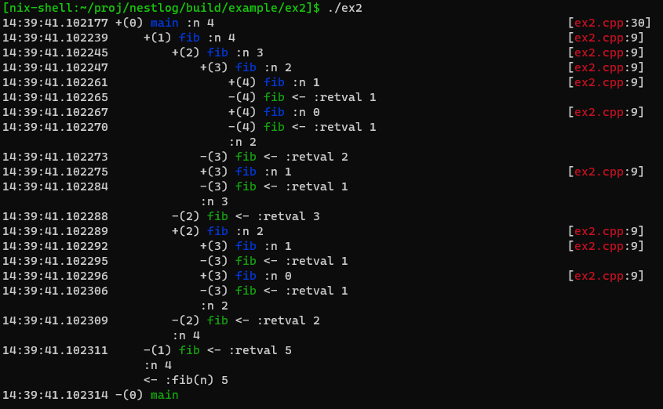
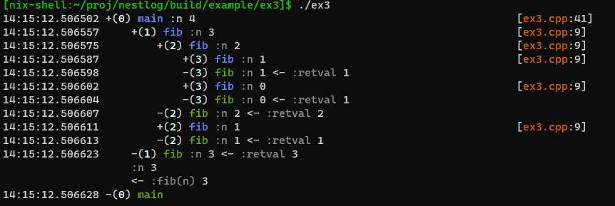

# nestlog -- logging with automatic call-graph indenting

Nestlog is a lightweight header-only library for console logging.

## Features

- header-only;  nothing to link
- easy-to-read format uses indenting to show call structure.
  indentation has user-controlled upper limit to preserve readability with
  deeply nested call graphs
- colorized output using vt100 color codes (ansi or xterm)
- automatically captures + displays timestamp, function name and code location.
  supports several function-name formats to reflect tradeoff readability for precision
- application code may issue logging code that contains embedded newlines and/or color escapes;
  logger preserves indentation.
- logger is 'truthy' -> only pay for formatting when entry points is enabled.
- also provides family of convenience stream-inserters

## Examples

### 1

    /* examples/ex1/ex1.cpp */

    #include "nestlog/scope.hpp"

    void A(int x) {
        XO_SCOPE(log);  // i.e. xo::scope log("A");

        log("enter ", ":x ", x);
    }

    int
    main(int argc, char ** argv) {
        A(66);
    }

output:

    +A
     enter :x 66
    -A

### 2

    /* examples ex2/ex2.cpp */

    #include "nestlog/scope.hpp"

    using namespace xo;

    int
    fib(int n) {
        scope log(XO_ENTER0(info), ":n ", n);

        int retval = 1;

        if (n >= 2) {
            retval = fib(n - 1) + fib(n - 2);
            log && log(":n ", n);
        }

        log.end_scope("<- :retval ", retval);

        return retval;
    }

    int
    main(int argc, char ** argv) {
        log_config::min_log_level = xo::log_level::info;
        log_config::indent_width = 4;

        int n = 4;

        scope log(XO_ENTER0(info), ":n ", 4);

        int fn = fib(n);

        log && log(":n ", n);
        log && log("<- :fib(n) ", fn);
    }

output:


### 3 example exposing runtime configuration options

    ```
    /* examples ex3/ex3.cpp */

    #include "nestlog/scope.hpp"

    using namespace xo;

    int
    fib(int n) {
        scope log(XO_ENTER0(info), tag("n", n));

        int retval = 1;

        if (n >= 2) {
            retval = fib(n - 1) + fib(n - 2);
        }

        log.end_scope(tag("n", n), " <-", xtag("retval", retval));

        return retval;
    }

    int
    main(int argc, char ** argv) {
        log_config::min_log_level = log_level::info;
        log_config::time_enabled = true;
        log_config::time_local_flag = true;
        log_config::style = FS_Streamlined;
        log_config::indent_width = 4;
        log_config::max_indent_width = 30;
        log_config::location_tab = 80;
        log_config::encoding = CE_Xterm;
        log_config::function_entry_color = 69;
        log_config::function_exit_color = 70;
        log_config::code_location_color = 166;

        int n = 3;

        scope log(XO_ENTER0(info), ":n ", 4);

        int fn = fib(n);

        log && log(tag("n", n));
        log && log("<-", xtag("fib(n)", fn));
    }

    /* ex3/ex3.cpp */
    ```

output:

